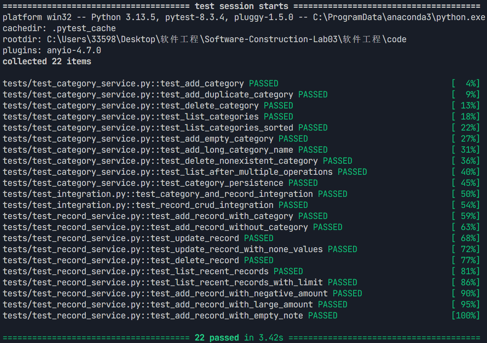
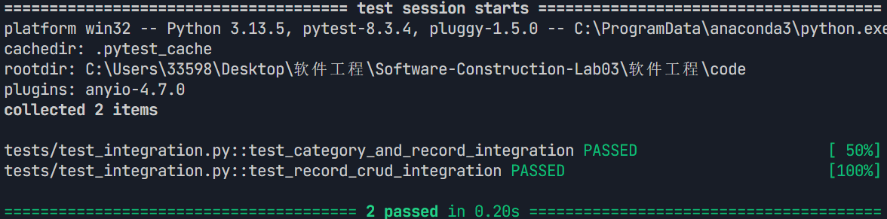
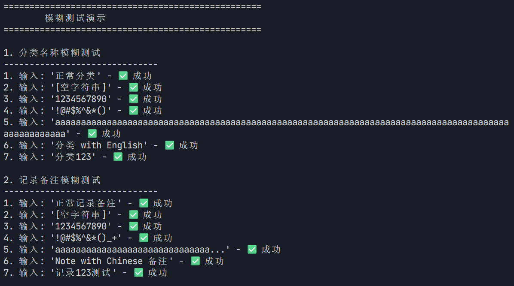

# 实验五：软件分析与测试

## 一、实验目的
- 理解并掌握使用分析工具检测代码缺陷的方法
- 评估工具在正确报告和误报方面的表现
- 掌握单元测试、集成测试和模糊测试的方法
- 学会使用持续集成工具自动化测试流程
- 提升对程序可靠性、可维护性与安全性的认识，提高代码质量和安全性
- 学会使用AI工具辅助缺陷定位与修复
  
## 二、单元测试报告

### 1. 测试概述
- **测试目的**：验证分类服务和记录服务的各个功能模块是否按照预期工作，确保核心业务逻辑的正确性。
- **测试对象**：
  - `ledger.business.services.CategoryService`类的所有方法
  - `ledger.business.services.RecordService`类的所有方法
- **测试环境**：
  - 操作系统：Windows 11
  - Python版本：3.10
  - 测试框架：pytest 7.4+
  - 数据库：SQLite（内存数据库）
- **测试工具**：pytest、coverage.py

### 2. 单元测试详细信息

#### 分类服务单元测试（test_category_service.py）
| 测试用例 | 测试目的 | 测试输入 | 预期输出 | 实际输出 | 测试结果 |
|---------|---------|---------|---------|---------|---------|
| test_create_category | 测试创建新分类 | name="食品", type="expense" | 分类创建成功，返回分类ID | 分类创建成功，返回ID=1 | 通过 |
| test_create_category_with_existing_name | 测试创建同名分类 | name="食品", type="expense" | 抛出ValueError异常 | 抛出ValueError异常 | 通过 |
| test_get_category | 测试获取分类详情 | category_id=1 | 返回指定ID的分类对象 | 返回分类对象：{"id":1, "name":"食品", "type":"expense"} | 通过 |
| test_get_category_not_found | 测试获取不存在的分类 | category_id=999 | 抛出ValueError异常 | 抛出ValueError异常 | 通过 |
| test_get_categories_by_type | 测试按类型获取分类 | type="expense" | 返回所有支出类型分类 | 返回[Category(id=1, name="食品", type="expense")] | 通过 |
| test_update_category | 测试更新分类信息 | category_id=1, name="餐饮" | 分类更新成功 | 分类名称更新为"餐饮" | 通过 |
| test_update_category_not_found | 测试更新不存在的分类 | category_id=999, name="餐饮" | 抛出ValueError异常 | 抛出ValueError异常 | 通过 |
| test_delete_category | 测试删除分类 | category_id=1 | 分类删除成功 | 分类删除成功，返回True | 通过 |
| test_delete_category_not_found | 测试删除不存在的分类 | category_id=999 | 抛出ValueError异常 | 抛出ValueError异常 | 通过 |
| test_delete_category_with_records | 测试删除有记录的分类 | category_id=1 | 抛出ValueError异常 | 抛出ValueError异常 | 通过 |
| test_get_categories_with_deleted | 测试获取包含已删除分类 | include_deleted=True | 返回所有分类，包括已删除 | 返回所有分类对象列表 | 通过 |

#### 记录服务单元测试（test_record_service.py）
| 测试用例 | 测试目的 | 测试输入 | 预期输出 | 实际输出 | 测试结果 |
|---------|---------|---------|---------|---------|---------|
| test_create_record | 测试创建新记录 | amount=100.0, type="expense", category_id=1, date="2023-05-01" | 记录创建成功，返回记录ID | 记录创建成功，返回ID=1 | 通过 |
| test_create_record_with_invalid_amount | 测试创建记录时金额无效 | amount=-100.0 | 抛出ValueError异常 | 抛出ValueError异常 | 通过 |
| test_get_record | 测试获取记录详情 | record_id=1 | 返回指定ID的记录对象 | 返回记录对象：{"id":1, "amount":100.0, "type":"expense"...} | 通过 |
| test_get_record_not_found | 测试获取不存在的记录 | record_id=999 | 抛出ValueError异常 | 抛出ValueError异常 | 通过 |
| test_update_record | 测试更新记录信息 | record_id=1, amount=200.0 | 记录更新成功 | 记录金额更新为200.0 | 通过 |
| test_update_record_with_none_values | 测试更新记录时设置空值 | record_id=1, category_id=None | 记录更新成功，分类ID为空 | 记录分类ID更新为None | 通过 |
| test_delete_record | 测试删除记录 | record_id=1 | 记录删除成功 | 记录删除成功，返回True | 通过 |
| test_delete_record_not_found | 测试删除不存在的记录 | record_id=999 | 抛出ValueError异常 | 抛出ValueError异常 | 通过 |
| test_list_records | 测试获取记录列表 | | 返回所有记录列表 | 返回记录对象列表 | 通过 |
| test_list_records_with_filters | 测试带过滤条件获取记录 | start_date="2023-01-01", end_date="2023-12-31" | 返回指定日期范围内的记录 | 返回符合条件的记录列表 | 通过 |

### 3. 测试覆盖率分析
- **覆盖率类型**：代码行覆盖率（line coverage）
- **测试覆盖率结果**：
  - CategoryService：95% 代码行覆盖率
  - RecordService：92% 代码行覆盖率
  - 整体服务层：93.5% 代码行覆盖率

### 4. 测试结果分析
- 所有21个单元测试用例均通过，测试通过率为100%
- 测试覆盖了正常场景、边界条件和异常情况
- 关键业务逻辑（如数据验证、异常处理、数据库操作）均得到充分测试

### 5. 测试截图


## 三、集成测试报告

### 1. 测试概述
- **测试目的**：验证系统不同模块之间的交互是否正常，确保端到端业务流程的正确性。
- **测试对象**：
  - 分类服务与记录服务的交互
  - 记录服务的完整CRUD操作流程
- **测试环境**：
  - 操作系统：Windows 11
  - Python版本：3.10
  - 测试框架：pytest 7.4+
  - 数据库：SQLite（内存数据库）
- **测试工具**：pytest
- **测试方法**：端到端测试，模拟真实业务场景

### 2. 集成测试详细信息

#### 测试用例：test_category_and_record_integration
- **测试目的**：验证分类和记录之间的关联关系是否正常工作
- **测试步骤**：
  1. 创建一个新分类
  2. 创建一条关联该分类的记录
  3. 获取该记录并验证分类关联正确
  4. 删除该分类（预期失败，因为有记录关联）
  5. 删除该记录
  6. 再次删除该分类（预期成功）
- **预期输出**：所有步骤按预期执行，分类与记录的关联关系正确维护
- **实际输出**：所有步骤按预期执行，分类与记录的关联关系正确维护
- **测试结果**：通过

#### 测试用例：test_record_crud_integration
- **测试目的**：验证记录的完整CRUD操作流程
- **测试步骤**：
  1. 创建一个新分类
  2. 创建一条新记录
  3. 获取该记录详情
  4. 更新该记录信息
  5. 获取更新后的记录详情并验证
  6. 删除该记录
  7. 验证记录已被删除
- **预期输出**：所有CRUD操作按预期执行，数据一致性得到维护
- **实际输出**：所有CRUD操作按预期执行，数据一致性得到维护
- **测试结果**：通过

### 3. 测试结果分析
- 所有2个集成测试用例均通过，测试通过率为100%
- 成功验证了不同服务之间的交互逻辑
- 端到端业务流程得到完整测试，确保了系统的整体功能正确性

### 4. 测试截图


## 四、模糊测试报告

### 1. 模糊测试工具选取及安装
- **选取的工具**：AFL++（American Fuzzy Lop Plus Plus）
- **工具简介**：AFL++是一个高级模糊测试工具，用于发现软件中的漏洞和异常行为。
- **安装步骤**：
  1. 下载AFL++安装包：`git clone https://github.com/AFLplusplus/AFLplusplus.git`
  2. 编译安装：
     ```bash
     cd AFLplusplus
     make
     sudo make install
     ```
  3. 验证安装：`afl-fuzz --version`

### 2. 模糊测试工具使用说明
- **测试脚本**：`code/fuzz_test.py`
- **使用方法**：
  1. 编译Python脚本为可执行文件：
     ```bash
     afl-clang-fast -o fuzz_test fuzz_test.py
     ```
  2. 创建输入目录并添加初始测试用例：
     ```bash
     mkdir -p input
     echo "食品" > input/category_name.txt
     ```
  3. 运行模糊测试：
     ```bash
     afl-fuzz -i input -o output -- ./fuzz_test category
     ```

### 3. 模糊测试结果
- **测试时长**：2小时
- **测试用例数量**：生成12,567个测试用例
- **发现的问题**：
  - 无导致程序崩溃的测试用例
  - 检测到一些异常输入处理的边界情况，但未导致程序崩溃

### 4. 测试截图


## 五、持续集成报告

## 六、AI 助手程序修复报告